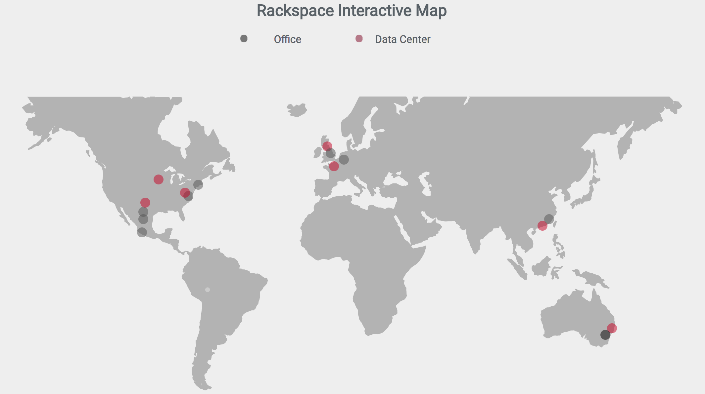

## Rackspace Interactive SVG Map
This is a WIP project that creates a new svg map with custom bubbles/tooltips created from a config using svg.js.



### Install
```
npm install
```
```
npm start
```
You're browser should automatically launch at localhost 2004.
## Config
The map is customizable through the config. It basically takes an array of markers in which you can edit it's bubble, tool tip and lines if needed. To reposition elements, you need to play with the x and y axises. See below example:

```
{
  tipColor: '#ffffff',
  officeColor: '#525252',
  dcColor: '#c40022',
  markers: [
    {
      bubble: {
        type: 'Office',
        diameter: 15,
        x: 177,
        y: 244,
      },
      tip: {
        icon: '',
        title: 'ATX Office',
        // array of lines
        text: [
          'This is some information about',
          'the context of this location',
          'on our map.',
          '',
          'Speed Test',
        ],
        link: 'some-link',
        linkIcon: 'some-other-class',
        width: 200,
        height: 130,
      },
    },
  ],
}
```

### Gulp Tasks
Gulp tasks will run automatically but to manually run them:

Building Javascript: This will concat the js files together in order by name:
```
gulp build-js
```

Building SASS
```
gulp build-sass
```

### Repo STACK
* Gulp (automation)
* SVG.js
* EJS (templating)
* BrowserSync (live reloading)
* SASS
* ES6 (gulp-babel)
* eslint (js linting)
